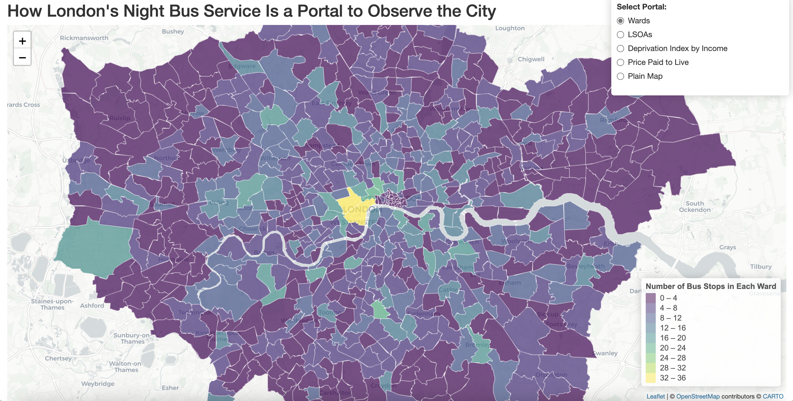

**Welcome to my first data visualisation project.**

# Introduction
This project uses transportation and its related datasets as a portal and a thread to reveal and correlate the social, economic and demographic situations of different areas of London that were usually hidden and unseen. 

This project is constructed using R programming language with few necessary packages, mainly shiny and tidyverse. At the current stage, it is represented as an interactive map with multiple layers, allowing users to switch between layers to form their own interpretations. This project is planned to transform to and create a scrolly-telling website, enabling more information to be displayed and interactivity to be integrated. 

This is also a part of my major project towards a master’s degree at Goldsmiths, University of London. 

# Visuals
Current public version of this project is an interactive map web application fully running on a remote R server client using shiny package and hosting on a remote server, which you can access at [this link](https://alternative-rush-hour.xuanyizhang.com/). Please allow a few seconds to one minute to load the data.

The image above is the interface of the map. In the up-right corner is the controlling panel for layers. These layers visualise the density of bus stops according to London wards and LSOAs, the income deprivation rankings, and the price paid to purchase a property in 2023 in selected areas by colours.  
Users can treat it as a typical map website specifically for the Greater London area but with four additional layers on top of an ordinary open-street map. What is essential for these layers is that they are critical aspects of this project, which create the correlation when the user wanders on the map, switching between different layers, dragging between different areas, and hovering in various locations. 

# Terminology
In this project, “transportation” refers to London’s intensive night bus service, and “related datasets” refers to public datasets, including Travel for London open data, HM Land Registry, Office of National Statistics, Ordnance Survey, and probably more in the future. The following are the breakdowns of these elements.

1. **The London Night Bus Service**. This service is run and managed by Travel for London (TfL), a government-owned public travel service organisation regulating transportation routes in the Greater London area, with some routes slightly beyond that boundary. As its name implies, the night bus service is delicately operated at night, typically from 1 am to 5 am. Each night bus has an “N” prefix before the route – you can’t see them during the daytime. According to TfL’s website, there are 62 routes of night buses.
2. **Travel for London Open Data**. This is the official website for accessing the operational data about TfL. Datasets include information about stations, underground/overground/light-rail lines, closures, running status, estimated times, roads, and more. At the current stage, this project only utilises sequences and locations for every night bus station.
3. **HM Land Registry**. This is a non-ministerial department of the UK government that records the ownership of land and property. Interesting datasets include selling prices of properties, as well as UK and foreign companies that own land or property in England and Wales. At the current stage, the first dataset is integrated into this project, and the other two datasets will be added shortly. These datasets provide additional comparisons of living expenses for individuals and workplace expenses for companies across locations.
4. **Office of National Statistics (ONS)**. This is also a non-ministerial department of the UK government, but it is more inclusive regarding the data it produces, covering almost every social, economic, and political aspect of the United Kingdom. At the current stage, this project chooses a dataset called “English Indices of Deprivation 2019”, which contains several domains to determine the level of deprivation for each LSOA (which stands for Lower Layer Super Output Area, based on households and the population of an area –1,000 to 3,000 people constitutes an LSOA) in England. This project has chosen income as an anchor layer to compare locations.
5. **Ordnance Survey (OS)**. This is a public corporation of the Department of Science, Innovation and Technology, specialising in mapping and is thus the source for detailed geographic data for this project. At the current stage, the project utilises three datasets from OS, namely “Boundary-Line”, “OS VectorMap District”, and “Code-Point Open” – the first two datasets are used to identify boundaries for London wards and buildings. The last dataset, which contains the postcode for every building, is set as the column to perform an inner join between HM Land Registry data and physical locations.

# Process
In the making of this project, two other tools were involved besides R programming Language, namely GIS software and open-source maps. 

The making process is roughly as follows:
1. Get geographic information (e.g., coordination of bus stops, boundaries of London wards, and contour lines of London buildings) from public datasets like the TfL open data API, ONS, and OS mentioned before.
2. For geographic information describing an area rather than a spot (primarily London wards, LSOAs, and buildings), they are usually packed and can be downloaded as polygon index shapefiles (.gml files or .shp files). Those files, although they can be opened through plain text editors, are impossible to read unless put into dedicated GIS software, which is capable of visualising and manipulating spatial information.
3. In this project, I chose QGIS as the GIS software. Because GIS software can perform data cleaning and preparation using geographic and graphical interfaces, it is implemented to trim unnecessary areas and aggregate related areas according to postcodes. This process ensures the validity of spatial data and relieves the data preparation workload in R Studio.
4. After the initial data cleaning work is done using QGIS, there are two types of data files. 1) A CSV file documenting the details of night bus stations, including names, supported routes with sequences of stopped bus stations, and, more importantly, the geographic coordinates for each bus stop. 2) Shapefiles that geographically describe the detailed boundaries of London wards, LSOAs, and the contours of every building within the selected wards.
5. When data is prepared, it will be mapped into an open-street map using R and related packages to code an integrated and interactive web-based map application. Packages supporting this project include “shiny”, “leaflet”, “sf”, “tidyverse”, and other packages dealing with API handling and colour palettes. At the current stage, open-street maps are primarily utilised as references and substrates where the above spatial and polygon data are displayed, manipulated, and interacted with. Therefore, the open-street map is both used in GIS software and final web application presentations.

# Installation
Speaking of installation, there are two ways to do this: installing it on a local computer and exhibiting it in a physical space.

If you would like to _run this project on your computer locally_, you need to have R Studio installed on your local computer with the zip file downloaded from the Releases section. In the zip file, there is an R script file called “map.R” and pre-cleaned data files named “stops.csv”, “wards.shp”, “lsoas.shp”, “deprivation.shp”, and “transaction.shp”. 

Please remember to **change the file locations of the above files to the actual file locations on your computer** in the map.R file after installation and downloading. If you already have the additional packages required for this project installed on your computer, you don’t have to run the “# install necessary packages” section; otherwise, please run the R script from the very beginning. 

Another version of this project can be installed in a physical space, which was practised at the graduation exposition of the degree mentioned above, which took place from the 12th to the 15th of July, 2024.

In the exposition, I set the project in a relatively dark space to mimic a night environment, with multiple screens placed around a chair to simulate the experience of riding a bus. The side screen here serves as a metaphor, where the videos played in the virtual window of the player application are the videos I shot through the actual window of the bus. Here, the virtual window and the actual window are collapsed into one that exists digitally on the screen and can be played and replayed over and over again with this stacked and removable existence.

The projection in front of the audience is installed this way on purpose. When the audience sits in the chair, their shadows can be projected on the wall to create a feeling that they are also riding the bus at night with other passengers and generate connections between their bodies, the screen in front of them, and the projection behind them.

# Key Findings
At the current stage, with current layers, this project's findings are universal but still provoking.

1. Overall, no matter whether viewed by wards or LSOAs, night bus stations tend to concentrate on Central London areas and spread out to the suburbs, or vice versa. Moreover, the LSOA layer provides an interesting perspective that the area with the most densely populated night bus stations in the central area (City of London 001F) is the place that has fewer people living there, which can be evidenced by its large size.
2. The centre-edge situation for night bus stations is not evenly distributed, as some suburban areas are populated with night bus stations while others are free of them. More interestingly, night-bus-hot areas tend to construct a line, while some night-bus-zero areas can merge into one larger area.
3. As for the correlations, it is clear in the comparison between multiple layers that when an area has more night bus stops, the residents there tend to have less income, and the property prices tend to be lower than in other areas without night bus stations. Besides, when viewing the LSOA level, the lines constructed by a sequence of night bus stations tend to overlap with the lines connected by adjacent areas with high income deprivations.

# Roadmap
The planned future development of this project includes:

1. **Change how the project is presented**. Move from the R server client to a scrolling and animating website that hybridises interactive maps, explanatory texts, concise images, and engaging interactions. This will create a linear yet more focused, informative, and inclusive narrative.
2. **Add more layers**. This includes 1) the amount of money a company has paid to buy or rent the place in central London, compared to the amount of money the company has paid to its night shift workers. 2) The demographic data about LSOAs, compared with the deprivation index and the density of night bus services.
3. **Open to more people**. Sort current R scripts and rewrite them into one R markdown file with clear instructions so that users without prior knowledge of R can run, test, and understand the scenes in front of and behind the project. 

# References
1.	[data about night bus stations](https://api-portal.tfl.gov.uk/api-details#api=Line&operation=Line_RouteSequenceByPathIdPathDirectionQueryServiceTypesQueryExcludeCrowding);
2.	[HM Land Registry datasets](https://use-land-property-data.service.gov.uk/);
3.	[Ordnance Survey datasets](https://osdatahub.os.uk/downloads/open);
4.	[English indices of deprivation 2019](https://www.gov.uk/government/collections/english-indices-of-deprivation);
